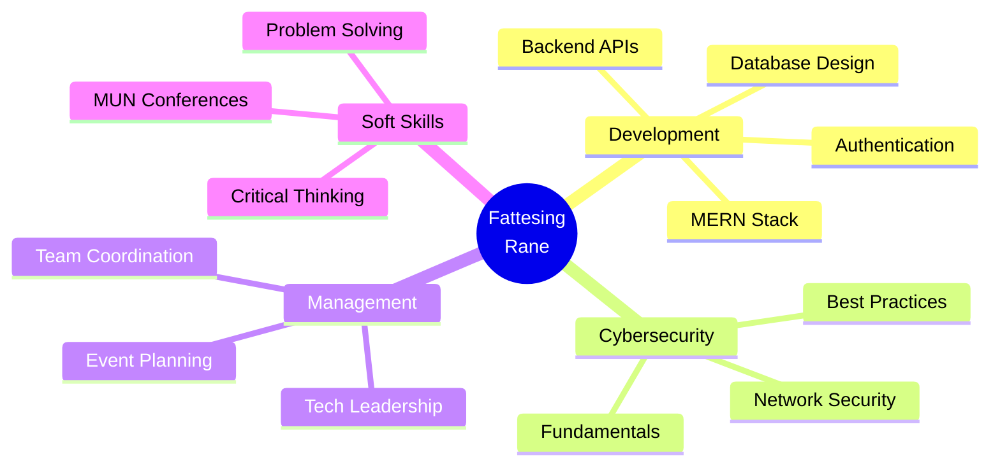

<!-- ===================== ANIMATED HEADER ===================== -->
<div align="center">
  
<!-- Animated Typing SVG -->
<a href="https://git.io/typing-svg"></a>

<!-- Animated Profile Views Counter -->


<!-- Animated Wave Line -->


</div>

<!-- ===================== MATRIX RAIN EFFECT ===================== -->
<div align="center">
  
```ascii
╔═══════════════════════════════════════════════════════════════════════╗
║  ▄████▄   ▒█████  ▓█████▄ ▓█████  ██▀███                            ║
║ ▒██▀ ▀█  ▒██▒  ██▒▒██▀ ██▌▓█   ▀ ▓██ ▒ ██▒                          ║
║ ▒▓█    ▄ ▒██░  ██▒░██   █▌▒███   ▓██ ░▄█ ▒                          ║
║ ▒▓▓▄ ▄██▒▒██   ██░░▓█▄   ▌▒▓█  ▄ ▒██▀▀█▄                            ║
║ ▒ ▓███▀ ░░ ████▓▒░░▒████▓ ░▒████▒░██▓ ▒██▒                          ║
║ ░ ░▒ ▒  ░░ ▒░▒░▒░  ▒▒▓  ▒ ░░ ▒░ ░░ ▒▓ ░▒▓░                          ║
║   ░  ▒     ░ ▒ ▒░  ░ ▒  ▒  ░ ░  ░  ░▒ ░ ▒░                          ║
╚═══════════════════════════════════════════════════════════════════════╝
```

</div>

<!-- ===================== ANIMATED ABOUT ME ===================== -->
<div align="center">

## 🎯  About Me

</div>


```python
class FattesingRane:
    def __init__(self):
        self.username = "Sunkencoder19"
        self.name = "Fattesing Rane"
        self.role = "Computer Engineering Student"
        self.university = "K J Somaiya School of Engineering"
        self. year = "Second Year"
        self.passions = ["Cybersecurity", "Backend Development", "Problem Solving"]
        self.learning_style = "Build → Break → Learn → Improve"
        
    def get_current_focus(self):
        return {
            "primary": ["MERN Stack", "Cybersecurity Fundamentals"],
            "exploring": ["Three.js", "Google Apps Script Automation"],
            "leadership": ["Tech Team Management", "Event Coordination"]
        }
    
    def philosophy(self):
        return "Build first. Learn deeply. Improve continuously."

me = FattesingRane()
print(me.philosophy())
```

<br clear="right"/>

<!-- ===================== ANIMATED TECH STACK ===================== -->
<div align="center">

## 🛠️  Tech Arsenal


</div>

### 💻 Languages & Frameworks

<p align="center">
  
</p>

<div align="center">

<!-- Animated Language Stats -->


</div>

### 🎨 Design & Tools

<p align="center">
  
  
</p>

<!-- ===================== ANIMATED DIVIDER ===================== -->


<!-- ===================== EXPERIENCE SECTION ===================== -->
<div align="center">

## 💼  Professional Journey

</div>

<table align="center">
<tr>
<td width="50%">

### 🎯 Deputy Head of Technology
**Prudencia** | *Present*

```javascript
const role = {
  responsibilities: [
    "Technical Planning & Execution",
    "Critical Thinking in Ideation",
    "Cross-team Tech Leadership"
  ],
  impact: "Driving tech innovation",
  team_size: "Multiple departments"
};
```

</td>
<td width="50%">

### 🤝 Delegate Affairs Team
**Prudencia** | *Dec 2024 – Jun 2025*

```javascript
const achievements = {
  coordination: "Multi-team stakeholders",
  management: "Delegate data workflows",
  skills: [
    "Communication",
    "Data Management",
    "Event Operations"
  ]
};
```

</td>
</tr>
</table>

<!-- ===================== PROJECTS SHOWCASE ===================== -->
<div align="center">

## 🚀  Featured Projects


</div>

<div align="center">
<table>
<tr>
<td width="50%" valign="top">

### 🌐 [Prudencia 2026 Website](https://www.prudencia.co.in)


Official website with automation & backend support

**Tech Stack:**
```yaml
Frontend: HTML, CSS, JavaScript
Backend: Node.js
Automation: Google Apps Script
Features: 
  - Event Management
  - Registration System
  - Real-time Updates
```

<p align="center">

</p>

</td>
<td width="50%" valign="top">

### 🛒 FlipMart E-Commerce


Full-stack MERN e-commerce platform

**Tech Stack:**
```yaml
Database: MongoDB
Backend: Express.js, Node.js
Frontend: React.js
Features:
  - User Authentication
  - Product Management
  - Shopping Cart
  - Order Processing
```

<p align="center">

</p>

</td>
</tr>
</table>
</div>

<!-- ===================== GITHUB STATS ===================== -->
<div align="center">

## 📊  GitHub Analytics


</div>

<p align="center">
  
  
</p>

<p align="center">
  
</p>

<!-- Trophy Section -->
<p align="center">
  
</p>

<!-- ===================== CONTRIBUTION SNAKE ===================== -->
<div align="center">

### 🐍 Watch my Contributions get Eaten! 

<picture>
  <source media="(prefers-color-scheme: dark)" srcset="https://raw.githubusercontent.com/Sunkencoder19/Sunkencoder19/output/github-contribution-grid-snake-dark.svg">
  <source media="(prefers-color-scheme: light)" srcset="https://raw.githubusercontent.com/Sunkencoder19/Sunkencoder19/output/github-contribution-grid-snake. svg">
  
</picture>

</div>

<!-- ===================== SKILLS CLOUD ===================== -->
<div align="center">

## 🎯 Skills Matrix


</div>



<!-- ===================== CONNECT SECTION ===================== -->
<div align="center">

## 🌐  Connect With Me


<p align="center">
  <a href="#" target="_blank">
    
  </a>
  <a href="#" target="_blank">
    
  </a>
  <a href="https://github.com/Sunkencoder19" target="_blank">
    
  </a>
  <a href="#" target="_blank">
    
  </a>
</p>

</div>

<!-- ===================== HOBBIES & INTERESTS ===================== -->
<div align="center">

## 🏊  Beyond Code

</div>

<table align="center">
<tr>
<td width="25%" align="center">

<br><b>🏊 Swimming</b>
<br>Competitive Swimmer
</td>
<td width="25%" align="center">

<br><b>🎾 Lawn Tennis</b>
<br>Sports Enthusiast
</td>
<td width="25%" align="center">

<br><b>🤝 MUN</b>
<br>Active Delegate
</td>
<td width="25%" align="center">

<br><b>🧑‍💼 Management</b>
<br>Team Leadership
</td>
</tr>
</table>

<!-- ===================== PHILOSOPHY SECTION ===================== -->
<div align="center">

## ⚡  Life Philosophy


</div>

```diff
@@                                                    @@
@@  "Build first. Learn deeply. Improve continuously."  @@
@@                                                    @@

+  🚀 Embrace challenges as learning opportunities
+  💡 Innovation through practical implementation  
+  🔄 Continuous growth mindset
+  🤝 Collaboration over competition
```

<!-- ===================== QUOTE SECTION ===================== -->
<div align="center">

### 💭 Daily Inspiration


</div>

<!-- ===================== VISITOR STATS ===================== -->
<div align="center">

## 👥 Visitor Stats & Activity


<!-- Detailed Profile Metrics -->
<p align="center">
  
  
  
</p>

</div>

<!-- ===================== CURRENT PROJECTS ===================== -->
<div align="center">

## 🔥 Currently Working On


</div>

- 🌐 Scaling **Prudencia 2026** platform with advanced features
- 🔐 Deep diving into **Cybersecurity** fundamentals and tools
- 🛒 Building robust backend for **FlipMart** e-commerce
- 📚 Exploring **advanced MERN stack** patterns and best practices
- 🎨 Experimenting with **Three.js** for 3D web experiences

<!-- ===================== FOOTER ===================== -->
<div align="center">


### 💙 Thanks for visiting! Let's build something amazing together! 


**⭐ From [Sunkencoder19](https://github.com/Sunkencoder19) with 💙**


</div>

<!-- ===================== HIDDEN EASTER EGG ===================== -->
<!-- 
██╗  ██╗███████╗██╗     ██╗      ██████╗     ███████╗██████╗ ██╗███████╗███╗   ██╗██████╗ 
██║  ██║██╔════╝██║     ██║     ██╔═══██╗    ██╔════╝██╔══██╗██║██╔════╝████╗  ██║██╔══██╗
███████║█████╗  ██║     ██║     ██║   ██║    █████╗  ██████╔╝██║█████╗  ██╔██╗ ██║██║  ██║
██╔══██║██╔══╝  ██║     ██║     ██║   ██║    ██╔══╝  ██╔══██╗██║██╔══╝  ██║╚██╗██║██║  ██║
��█║  ██║███████╗███████╗███████╗╚██████╔╝    ██║     ██║  ██║██║███████╗██║ ╚████║██████╔╝
╚═╝  ╚═╝╚══════╝╚══════╝╚══════╝ ╚═════╝     ╚═╝     ╚═╝  ╚═╝╚═╝╚══════╝╚═╝  ╚═══╝╚═════╝ 
Thanks for reading the source code! You're a real developer! 🚀
-->
